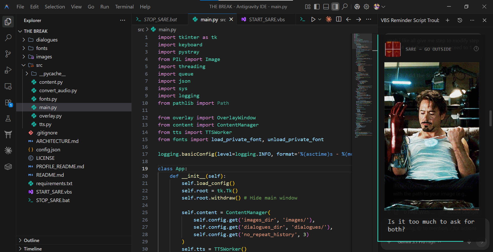

# SARE (Stark Autonomous Rest Engine)

<div align="center">
  
  
  
  
</div>

<br>

<div align="center">
  
</div>

<br>

A premium, minimalist Windows desktop utility that runs silently in the background and acts as an immersive break reminder. On a custom timer or global hotkey press, a sleek, Streamlabs-style HUD panel smoothly slides onto your screen, playing highly realistic Iron Man audio clips synced to beautifully formatted subtitles. 

The perfect fusion of productivity and fandom, designed to get you to actually take a screen break.

## ✨ Premium Features
- **Streamer-Style HUD Overlay:** A beautiful, docked right-panel interface featuring eased slide-and-fade physics animations and a subtle depleting countdown bar.
- **Interactive Auto-Timer:** Click the clock icon on the HUD to pause the countdown and open a context menu. Set it to loop every 15m, 30m, 1h, or type in a custom interval. The app will automatically spawn the overlay in the background when it's time to rest.
- **Dynamic Two-Tier Image Engine:**
  - **Tier 1 (Avatars):** Dynamically uses `Pillow` to generate perfectly square, rounded-corner thumbnail avatars from your image folder on the fly. Guaranteed to show on every trigger.
  - **Tier 2 (Full Images):** Configurable chance (e.g., 20%) to expand the HUD vertically and display a large, cinematic full image above the text.
- **Smart Asset Cycling:** Implements a no-repeat history queue so you never hear the same voice clip or see the same image twice in a row.
- **Direct Audio Playback:** Completely custom audio engine built on `pygame.mixer` that pipes your local `.mp3` clips directly into the app, mapping the filenames to grammatically perfect, on-screen subtitles.
- **Invisible Execution:** Includes a `Start Hidden.vbs` script to run the app entirely in the background without leaving an ugly command prompt open. Control it entirely from your Windows System Tray!

## 🚀 Installation

1. Clone the repository:
   ```bash
   git clone https://github.com/yourusername/SARE.git
   cd SARE
   ```

2. Install the required Python packages:
   ```bash
   pip install -r requirements.txt
   ```

3. Ensure you have the following directories set up in the root of the project:
   - `images/` (put your .png, .jpg, .gif, or .jfif files here for the dynamic avatars and full images)
   - `dialogues/` (put your local `.mp3` audio clips here. The app uses the filename as the subtitle text on screen!)

## 💻 Usage

**Option 1: Silent Background Mode (Recommended)**
Double-click `START_SARE.vbs`. The application will launch invisibly in your system tray without any console window. 

**Option 2: Terminal Mode**
```bash
python src/main.py
```

### Controls
- **Trigger Manually:** Press `Win+Ctrl+R` from any app or window.
- **Set Auto-Timer:** Trigger the overlay, click the small clock icon in the top right, and select your loop interval.
- **Dismiss early:** Press `Esc` while the overlay is on the screen.
- **Quit:** Right-click the SARE icon in your system tray and select "Quit".

## ⚙️ Configuration
The entire visual and functional identity is driven by `config.json`. You can completely re-theme the app without touching the code:
- `accent_color`: Change the teal border strip to any hex color.
- `tick_interval_ms`: Modify the animation physics and bar depletion smoothness.
- `full_image_chance`: Tweak how often the large cinematic images appear.
- `panel_bg` & `panel_opacity`: Adjust the background aesthetics.
